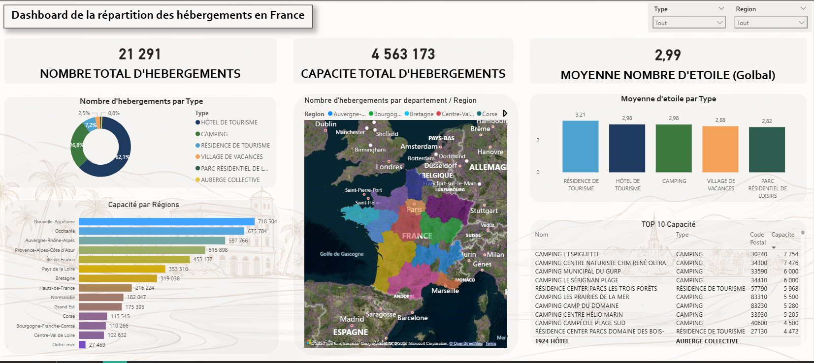

# 📊 PROJET FINAL – DATA PIPELINE (Scraping → ETL → API)

---

# 1. README – LANCEMENT DU PROJET

## 🚀 Description

Ce projet est un pipeline de données complet basé sur les **hébergements touristiques classés en France** (source officielle : Atout France / data.gouv.fr) :

* Scraping de données CSV depuis data.gouv.fr
* Nettoyage et transformation des données
* Stockage Data Lake (CSV / JSON)
* Stockage MongoDB (RAW + CLEAN)
* Data Warehouse PostgreSQL (schéma analytique)
* API REST avec FastAPI
* Dashboard BI avec Power BI

---

## 🧱 Architecture

Flux de données :

```
CSV Atout France (data.gouv.fr)
   ↓
Scraping
   ↓
Cleaning (normalisation, typage, extraction département/étoiles)
   ↓
MongoDB (RAW + CLEAN)
   ↓
Data Lake (CSV/JSON)
   ↓
PostgreSQL (DW) — schéma analytique
   ↓
API REST (FastAPI)
   ↓
Power BI (BI)
```

---

# 2. TECHNOLOGIES

* Python 3.11
* Pandas
* MongoDB
* PostgreSQL
* FastAPI
* Docker / Docker Compose
* Power BI

---

# 3. SOURCE DES DONNÉES

**Jeu de données** : Hébergements touristiques classés en France  
**Producteur** : Atout France – Agence de développement touristique de la France  
**Licence** : Licence Ouverte / Open Licence  
**URL** : https://data.classement.atout-france.fr/static/exportHebergementsClasses/hebergements_classes.csv  
**Page data.gouv.fr** : https://www.data.gouv.fr/datasets/hebergements-touristiques-classes-en-france  

Types d'hébergements couverts :
* Hôtel de tourisme
* Camping
* Village de vacances
* Résidence de tourisme
* Parc résidentiel de loisirs
* Auberge collective

---

# 4. INSTALLATION & LANCEMENT

## 📦 1. Cloner le projet

```bash
git clone <repo>
cd Projet_Final
```

---

## 🐳 2. Lancer avec Docker dans 1er Terminal

```bash
docker compose down -v
docker compose up --build
```

---

## 🔥 3. Vérifier les containers dans un 2eme Terminal

```bash
docker ps
```

Attendu :

* api
* postgres_dw
* mongo_db
* app_data

---

Lancer la page web : 

* Fichier html : LiveServer ou /frontend  python -m http.server 5500

Page : http://localhost:5500

---

# 5. PIPELINE AUTOMATIQUE

Le pipeline s'exécute automatiquement au démarrage :

### Étapes :

1. Téléchargement CSV Atout France (data.gouv.fr)
2. Sauvegarde RAW (`data/raw/hebergements_raw.csv`)
3. Nettoyage et transformation des données
4. Insertion MongoDB RAW
5. Insertion MongoDB CLEAN
6. Export Data Lake JSON (`data/lake/hebergements.json`)
7. Chargement PostgreSQL (DW)

---

# 6. BASE DE DONNÉES (POSTGRESQL)

## Table principale

```sql
hebergements (
    id                  SERIAL PRIMARY KEY,
    nom                 TEXT,
    type_hebergement    TEXT,
    classement          TEXT,
    nb_etoiles          FLOAT,
    adresse             TEXT,
    code_postal         TEXT,
    commune             TEXT,
    departement         TEXT,
    site_internet       TEXT,
    capacite            FLOAT,
    nb_chambres         FLOAT,
    nb_emplacements     FLOAT,
    date_classement     TEXT,
    classement_proroge  TEXT
)
```

## Tables de dimension (schéma analytique)

```sql
dim_type_hebergement (
    id                SERIAL PRIMARY KEY,
    type_hebergement  TEXT UNIQUE
)

dim_departement (
    id           SERIAL PRIMARY KEY,
    departement  TEXT UNIQUE
)
```

## Vérifier PostgreSQL dans le 2 eme Terminal

```bash
docker exec -it postgres_dw psql -U postgres

\c dw
SELECT * FROM hebergements LIMIT 5;
SELECT type_hebergement, COUNT(*) FROM hebergements GROUP BY type_hebergement;
```

---
# 7. Streamlit

## Lancer le Streamlit dans un 3eme Terminal

```bash
docker compose up --build streamlit
```

## Documentation interactive

```
http://localhost:8501
```

# 8. API REST

## Lancer l'API dans un 4eme Terminal

```bash
docker compose up --build api
```

## Documentation interactive

```
http://localhost:8000/docs
```

## Endpoints

Principal : 
http://localhost:8000/docs

Utils : 
http://localhost:8000/stats
http://localhost:8000/hebergements

### GET /
Statut de l'API

---

### GET /hebergements
Retour des hébergements avec **filtres** et **pagination**

Paramètres disponibles :

| Paramètre | Type | Description |
|-----------|------|-------------|
| `limit` | int | Nombre de résultats (défaut : 10) |
| `offset` | int | Pagination (défaut : 0) |
| `type_hebergement` | string | Ex: `HÔTEL DE TOURISME`, `CAMPING` |
| `departement` | string | Ex: `75`, `13`, `69` |
| `nb_etoiles` | float | Ex: `3`, `4`, `5` |
| `commune` | string | Ex: `PARIS`, `LYON` |

```json
[
  {
    "id": 1,
    "nom": "1924 HÔTEL",
    "type_hebergement": "HÔTEL DE TOURISME",
    "classement": "3 étoiles",
    "nb_etoiles": 3.0,
    "commune": "GRENOBLE",
    "departement": "38",
    "capacite": 62.0,
    "nb_chambres": 37.0
  }
]
```

---

### GET /stats
Statistiques globales

```json
{
  "total_hebergements": 18000,
  "moyenne_etoiles": 2.85,
  "moyenne_capacite": 124.5,
  "capacite_totale": 2240000,
  "total_chambres": 850000,
  "total_emplacements": 320000
}
```

---

### GET /stats/type
Statistiques groupées par type d'hébergement

---

### GET /stats/departement
Statistiques groupées par département (top 20 par défaut)

---

### GET /stats/classement
Statistiques groupées par classement

---

### GET /top
Top hébergements par capacité d'accueil

---

### GET /recherche?q=
Recherche par nom d'établissement

---

### GET /hebergements/{id}
Détail d'un hébergement par ID

---

# 9. DATA LAKE

Stockage :

* `data/raw/` — données brutes CSV (séparateur `;`)
* `data/clean/` — données nettoyées CSV
* `data/lake/` — export JSON exploitable

Format :

* CSV (raw et clean)
* JSON (lake)

---

# 10. MONGODB

Collections :

* `raw` — données brutes importées
* `clean` — données nettoyées et transformées

Objectif :

* historisation des données
* traçabilité ETL
* accès NoSQL flexible

---

# 11. QUALITÉ DES DONNÉES

Traitements appliqués :

* Suppression des doublons
* Suppression des lignes sans nom ni commune
* Remplacement des `"-"` par `null`
* Renommage des colonnes (suppression accents, majuscules, parenthèses)
* Conversion des colonnes numériques (`capacite`, `nb_chambres`, `nb_emplacements`)
* Extraction du département depuis le code postal (`str[:2]`)
* Extraction du nombre d'étoiles en valeur numérique (`nb_etoiles`) depuis la colonne `classement` textuelle

---

# 12. POWER BI (BI)

Connexion directe à PostgreSQL :

| Paramètre | Valeur |
|-----------|--------|
| Serveur | `localhost` |
| Port | `5432` |
| Base | `dw` |
| Utilisateur | `postgres` |
| Mot de passe | `postgres` |

Visuels disponibles :



* Répartition des hébergements par type
* Nombre d'hébergements par département
* Moyenne des étoiles par type
* Capacité totale par région
* Top établissements par capacité

---

# 13. DATA ENGINEERING (ARCHITECTURE)

Respect des principes :

* Séparation des couches (scraping / cleaning / storage / API)
* Modularité (un fichier par responsabilité)
* Pipeline automatisé au démarrage
* Conteneurisation complète Docker

---

# 14. LIMITES

* Pas de coordonnées GPS dans le dataset source (pas de carte)
* Pas de streaming temps réel
* Tests unitaires limités

---

# 15. AMÉLIORATIONS POSSIBLES

* Tests Pytest complets
* Orchestration Airflow
* CI/CD GitHub Actions
* Ajout d'un second dataset (fréquentation touristique) pour enrichissement

---

# 16. CONCLUSION

Ce projet démontre :

✔ Ingestion de données open data officielles (data.gouv.fr)  
✔ Transformation ETL complète  
✔ Stockage multi-systèmes (MongoDB + PostgreSQL + Data Lake)  
✔ Exposition API REST avec filtres et pagination  
✔ Exploitation BI via Power BI